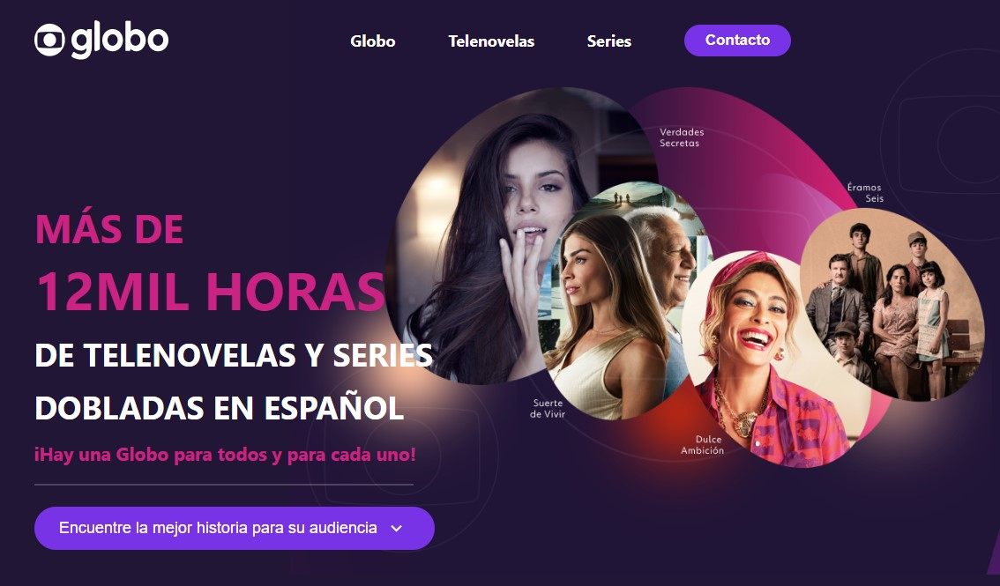

<p align="center">
  

  

  <a href="https://www.twitter.com/tgmarinho/">
    
  </a>
  
  <a href="https://github.com/cadufc91/Vx/commits/master">
    
  </a>
    
   
   <a href="https://github.com/cadufc91/Vx/stargazers">
    
  </a>
  
 
</p>
<h1 align="center">
    
</h1>

<h4 align="center"> 
	🚧  Vx - Concluído 🚀 🚧
</h4>

<p align="center">
 <a href="#-sobre-o-projeto">Sobre</a> •
 <a href="#-funcionalidades">Funcionalidades</a> •
 <a href="#-layout">Layout</a> • 
 <a href="#-como-executar-o-projeto">Como executar</a> • 
 <a href="#-tecnologias">Tecnologias</a> • 
 <a href="#-contribuidores">Contribuidores</a> • 
 <a href="#-autor">Autor</a> • 
 <a href="#user-content--licença">Licença</a>
</p>


## 💻 Sobre o projeto

Vx - é uma landing page criada para atração de novos clientes e a demonstração dos conteudos da emissora brasileira Globo para o público que tem como sua língua materna o espanhol.


Projeto desenvolvido durante a **Desafio técnico**.

---

## ⚙️ Funcionalidades

- [x] Demonstração de novelas e series disponíveis em toda plataforma:
  - [x] novelas que fizeram grande sucesso entre o público brasileiro
  - [x] histórico de entretenimento presente em mais de 70 idiomas
  - [x] séries que fizeram grande sucesso entre o público brasileiro

- [x] Os usuários preenchem um formulário de contato:
  - [x] dados básicos como: nome, e-mail e empresa 
  - [x] informação de como conheceu a emissora 

---

## 🎨 Layout

O layout da aplicação está disponível no Figma:

<a href="https://www.figma.com/file/MZL3iGGCOCVO1DqztOtx3A/LandingPage?node-id=0%3A1">
  
</a>

---

## 🚀 Como executar o projeto

Este projeto foi desenvolvido somente o Frontend.

### Pré-requisitos

Antes de começar, você vai precisar ter instalado em sua máquina as seguintes ferramentas:
[Git](https://git-scm.com), [Node.js](https://nodejs.org/en/). 
Além disto é bom ter um editor para trabalhar com o código como [VSCode](https://code.visualstudio.com/)


#### 🧭 Rodando a aplicação web (Frontend)

```bash
# Clone este repositório
$ git clone https://github.com/Cadufc91/Vx.git
# Acesse a pasta do projeto no seu terminal/cmd
$ cd vx
# Instale as dependências
$ npm install
# Execute a aplicação em modo de desenvolvimento
$ npm run start
# A aplicação será aberta na porta:3000 - acesse http://localhost:3000
```

---

## 🛠 Tecnologias

As seguintes ferramentas foram usadas na construção do projeto:

#### **Website**  ([React](https://reactjs.org/)  +  [TypeScript](https://www.typescriptlang.org/))

-   **[React Icons](https://react-icons.github.io/react-icons/)**
-   **[Styled Components](https://github.com/styled-components/styled-components)**
-   **[SwiperJS](https://github.com/nolimits4web/swiper)**

> Veja o arquivo  [package.json](https://github.com/cadufc91/Vx/blob/master/web/package.json)
#### [](https://github.com/tgmarinho/Ecoleta#server-nodejs--typescript)

**Utilitários**
-   Protótipo:  **[Figma](https://www.figma.com/)**  →  **[Protótipo (Landing Page)](https://www.figma.com/file/MZL3iGGCOCVO1DqztOtx3A/LandingPage?node-id=0%3A1)**
-   Editor:  **[Visual Studio Code](https://code.visualstudio.com/)**
-   Markdown:  **[StackEdit](https://stackedit.io/)**,  **[Markdown Emoji](https://gist.github.com/rxaviers/7360908)**


---

## 👨‍💻 Contribuidores

<table>
  <tr>
    <td align="center"><a href="https://cadufc-portfolio.vercel.app/"><br /><sub><b>Cadu Fernandes</b></sub></a><br /><a href="https://cadufc-portfolio.vercel.app/">👨‍💻</a></td>
  </tr>
</table>

## 💪 Como contribuir para o projeto

1. Faça um **fork** do projeto.
2. Crie uma nova branch com as suas alterações: `git checkout -b my-feature`
3. Salve as alterações e crie uma mensagem de commit contando o que você fez: `git commit -m "feature: My new feature"`
4. Envie as suas alterações: `git push origin my-feature`
> Caso tenha alguma dúvida confira este [guia de como contribuir no GitHub](./CONTRIBUTING.md)
---
## 🦸 Autor

<a href="https://cadufc-portfolio.vercel.app/">
 
 <br />
 <sub><b>Cadu Fernandes</b></sub></a> <a href="https://cadufc-portfolio.vercel.app/">🚀</a>
 <br />

 [](https://www.linkedin.com/in/carloseduardo-fernandes/) 
[](mailto:fernandes.cadu@gmail.com)

---

## 📝 Licença

Este projeto esta sobe a licença [MIT](./LICENSE).

Feito com ❤️ por Cadu Fernandes 👋🏽 [Entre em contato!](https://www.linkedin.com/in/tgmarinho/)

---

##  Versões do README

[Português 🇧🇷](./README.md)  |  [Inglês 🇺🇸](./README-en.md) 
